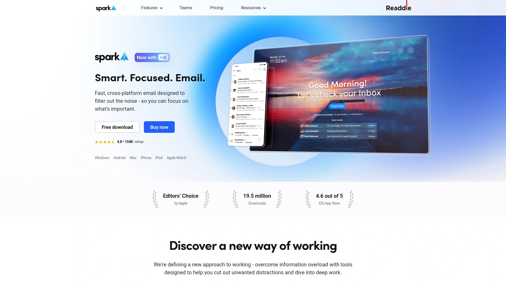

# Top 10 Best Email Management Tools in 2025

Struggling with an overflowing inbox? The right email management tool can help you achieve inbox zero, organize important messages, and automatically clean out unwanted subscriptions. These platforms save hours every week by simplifying email organization and helping you maintain control of your digital communications.

## **[Clean Email](https://clean.email)**

A powerful inbox cleaner that helps you organize emails into relevant groups for efficient bulk actions and smart automation rules.

Clean Email stands out with its intelligent categorization system that automatically sorts your messages into easy-to-manage bundles. The platform's Quick Clean feature identifies and groups similar emails, allowing you to process hundreds of messages in just a few clicks.

Its strongest features include:
- **Smart Views** that automatically organize your inbox by category
- **Auto Clean rules** for setting up automated email maintenance
- **Unsubscriber tool** that helps identify and remove unwanted subscriptions
- **Privacy-first approach** with no access to email content, only headers

The platform works with Gmail, Yahoo, Outlook, iCloud and other major email providers, making it ideal for both personal and professional users looking to maintain a clean inbox without spending hours manually sorting through messages.

## **[Unroll.me](https://unroll.me)**

A streamlined solution that focuses specifically on identifying and managing your email subscriptions through a single daily digest.

Unroll.me scans your inbox to identify subscription emails and presents them in an intuitive interface where you can choose to keep them in your inbox, unsubscribe completely, or "roll up" multiple subscriptions into a single daily digest. This approach dramatically reduces inbox clutter while ensuring you don't miss important newsletters.

The platform offers a simple, user-friendly interface that makes the unsubscribe process almost effortless. While it doesn't offer the advanced filtering capabilities of some competitors, its specialized focus on subscription management makes it exceptionally effective for users primarily struggling with newsletter overload.

## **[SaneBox](https://sanebox.com)**

An AI-powered email management assistant that automatically prioritizes important emails and filters out distractions.

SaneBox works behind the scenes to analyze your email patterns and relationships, then sorts incoming messages based on importance. Important emails stay in your inbox while less urgent ones are moved to separate folders for later review.

Key features include:
- **SaneLater** folders that automatically capture non-urgent emails
- **SaneNoReplies** tracking for emails awaiting responses
- **SaneAttachments** for finding and organizing files
- **SaneBlackHole** for permanently blocking unwanted senders

The service integrates seamlessly with any email client or service, requiring no downloads or installations. It's particularly valuable for professionals who receive high volumes of email and need help separating critical communications from noise.

## **[Mailstrom](https://mailstrom.co)**

A visual email management tool that helps you identify and process large groups of related emails simultaneously.

Mailstrom's unique approach displays your email in sortable views organized by sender, subject, time, size, and other parameters. This visualization makes it easy to spot patterns and bulk-process similar messages. The platform excels at helping users quickly reduce overwhelming inboxes with thousands of unread emails.

Its "Chill" feature allows you to temporarily remove emails from your inbox until a specific time when you're ready to deal with them—perfect for maintaining focus during important projects. The service supports one-click unsubscribe functionality and sender blocking to prevent future email clutter.

## **[Boomerang](https://boomeranggmail.com)**

An email productivity tool focused on scheduling, follow-ups, and response tracking to help manage email communication flow.

Boomerang's standout feature is its ability to schedule emails to be sent at optimal times and temporarily remove emails from your inbox until you need them. The service also excels at tracking responses and sending automatic follow-up reminders if recipients don't reply within a specified timeframe.

Additional tools include:
- **Inbox Pause** to temporarily stop new emails from arriving
- **Respondable** AI assistant for writing better emails
- **Brief Me** for morning email summaries
- Calendar integration for simplified scheduling

Primarily designed for Gmail and Outlook users, Boomerang is particularly useful for sales professionals, customer service teams, and anyone who relies on timely email communication.

## **[CleanFox](https://cleanfox.io)**

An environmentally-conscious email cleaner that focuses on subscription management while highlighting the carbon impact of your email habits.

CleanFox stands out by connecting email management to environmental awareness. The platform shows the carbon footprint reduction achieved through cleaning your inbox, adding a meaningful dimension to the usual productivity benefits. Its simple swipe interface makes it quick to unsubscribe from newsletters or keep the ones you value.

The service is particularly effective at identifying subscription emails even when they come from different sender addresses. While more limited in advanced features compared to comprehensive email managers, CleanFox excels in its specialized focus on newsletter management with a user-friendly approach.

## **[Subscription Zero](https://subscriptionzero.com)**

A dedicated tool for identifying and managing all your paid and free subscriptions through email analysis and smart categorization.

Subscription Zero offers a unique approach by helping users track both email subscriptions and paid services through email receipt analysis. The platform creates a comprehensive dashboard of all your recurring expenses and free subscriptions, making it easier to identify unused services and manage your digital footprint.

The tool provides notifications before renewal dates and simplifies the cancellation process for services you no longer need. It's particularly valuable for budget-conscious users who want to maintain control over both their inbox and subscription expenses.

## **[HEY](https://hey.com)**

A complete reimagining of email that sorts incoming messages into separate workflows based on their purpose and importance.

Unlike traditional email cleaners that work with existing providers, HEY is a standalone email service with built-in organization tools. Its innovative "Screener" feature lets you decide which senders deserve your attention before they reach your inbox, while the "Imbox" (important inbox) separates essential communications from newsletters and receipts.

HEY's unique approach includes:
- **Paper Trail** for receipts and notifications
- **The Feed** for newsletters and digests
- **Reply Later** for messages that need thoughtful responses
- **Clips** for saving important information from emails

This comprehensive redesign of the email experience works best for users willing to switch email providers for a more controlled communication environment.

## **[Spark](https://sparkmailapp.com)**

A smart email client focused on team collaboration and advanced organization features for professional email management.

Spark combines powerful personal email management with collaborative capabilities for teams. Its Smart Inbox automatically categorizes emails into Personal, Notifications, and Newsletters, while its advanced search functionality makes finding specific messages remarkably easy.

For teams, Spark enables:
- Collaborative email composition and editing
- Private team discussions about specific emails
- Shared email delegation and task assignment
- Template creation for frequent responses

The platform's scheduling features and follow-up reminders help maintain an organized workflow. Spark is particularly valuable for small teams and professionals who collaborate on email communication regularly.

## **[Edison Mail](https://edison.tech)**

An AI-enhanced email client that combines smart organization with travel itinerary tracking and security features.

Edison Mail uses artificial intelligence to automatically categorize messages and highlight important information. Its Assistant feature extracts key details like package tracking, flight information, and bills, presenting them in an organized dashboard for quick access.

Notable features include:
- **Price tracking** for online purchases
- **One-tap unsubscribe** functionality
- **Travel notifications** with real-time updates
- **Block sender** capabilities with customizable filters

Edison's focus on privacy and security, including its anti-phishing protection, makes it appealing to security-conscious users. The platform works well for frequent travelers and online shoppers who want their email to automatically surface relevant information.

## FAQ

#### What's the difference between email cleaners and email clients?
Email cleaners focus specifically on organizing, removing, and managing existing emails in bulk, while email clients are complete interfaces for sending, receiving, and managing all email communications. Many modern tools combine aspects of both to provide comprehensive email management.

#### How often should I clean my inbox?
For optimal email management, schedule weekly 15-minute sessions using your chosen tool's automation features. Setting up automatic rules for recurring emails can maintain inbox organization with minimal ongoing effort.

#### Are these tools safe to use with sensitive emails?
Most reputable email management tools use OAuth authentication and don't store your passwords. However, privacy policies vary—[Clean Email](https://clean.email) and several others on this list specifically focus on privacy-first approaches, only processing email headers rather than content when possible.

## Conclusion

Managing your inbox doesn't have to be overwhelming with the right tools at your disposal. Each of these email management solutions offers unique features to help you regain control of your digital communications. For most users seeking a balance of powerful organization features and privacy protection, [Clean Email](https://clean.email) provides the comprehensive toolkit needed to achieve and maintain inbox zero without sacrificing security.
